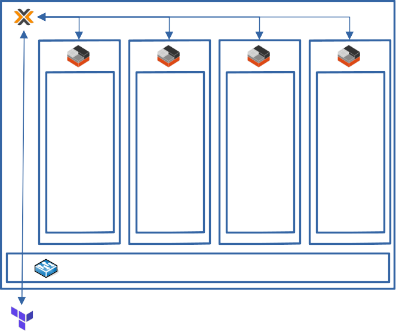

## Description
**Creating Debian instances on Proxmox with Terraform using Telmate provider**

## Goal

## Autor
* [Erki Polo Manresa](https://linkedin.com/in/erkipolo)

## To see how get to the solution
* [Youtube link coming soon](Próximamente)

## Requirements
- Proxmox installed
- A token user from Proxmox
- A Debian container template inside local storage
  - version = standard_12.7-1_amd64 (it's a variable)
- Terraform installed
- An internet connection
